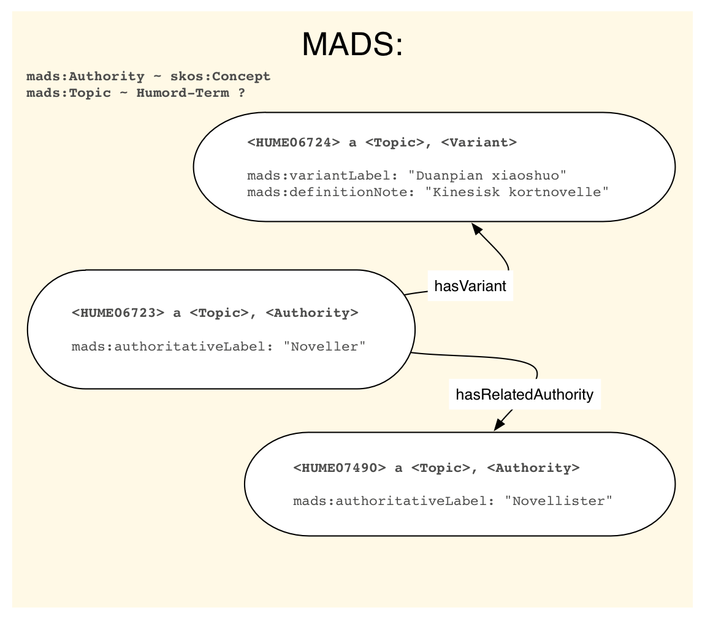
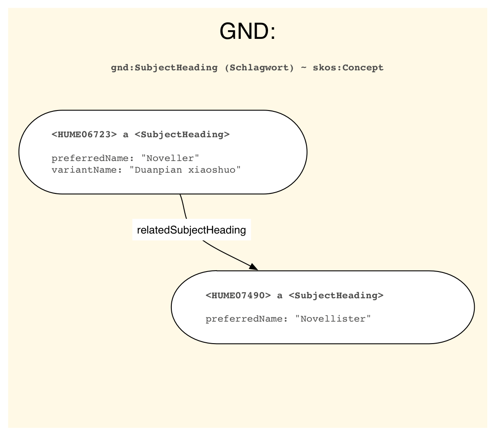

(OBS! Skissene kan inneholde feil! Navnerom er utelatt for forenklingens skyld)

Noe som sent gikk opp for meg var at det faktisk er et markant skille mellom datamodellen i Realfagstermer og Humord.
- Realfagstermer bygger på en begrepsbasert modell som er kompatibel med både SKOS, ISO 25694 og GNDs modell (bortsett fra strengene).
- Humord bygger på en termbasert modell som er kompatibel med ISO 2788. Den kan enkelt konverteres til ISO 25694, men ikke til SKOS.

I mange tilfeller er ikke skillet av betydning. Det er lett å forestille seg hvordan to termer relatert gjennom en "SE"-relasjon er uttrykk for det samme underliggende begrepet, selv om begreper ikke er eksplisitt uttrykt i ISO 2788 (OK, jeg må innrømme at jeg ikke har lest ISO 2788).

Men djevelen ligger som vanlig i detaljene. Først var det de generelle se-henvisningene, som bryter fundamentalt med SKOS-modellen. Men så var det en ting til, som jeg ikke har vært klart over før nå: note-felter på se-henvisninger. Disse er så sjeldne i Humord at jeg hadde oversett dem, men de finnes altså;

	HUME06723
	TE Noveller

	HUME06724
	TE Duanpian xiaoshuo
	DE Kinesisk kortnovelle
	SE HUME06723

	HUME07490
	TE Novellister

Dette er umulig å uttrykke i SKOS, men det er mulig i SKOS-XL og ISO 25694. La oss begynne med å se på hvordan vi kan tegne begrepet `HUME06723 "Noveller"` etter ISO 2788-modellen:

Vi ser at begreper ikke er eksplisitt uttrykt, så vi må resonnere oss frem til at det finnes et underliggende begrep. La oss hoppe til ISO 25694:

Her ser vi hvordan begreper er eksplisitt uttrykt, og vi ser at ISO 25964 er en mer komplisert modell enn ISO 2788. SKOS er, som ISO 25694, begrepsbasert, men også enklere. I SKOS er ikke termene egne entiteter som selv kan ha noter og definisjoner.

Siden altLabel er literaler, ikke klasser, har vi rett og slett ingen mulighet til å legge på definisjonen "Kinesisk kortnovelle". Bam! Så var det noen som laget SKOS-XL:

som vi ser ligger nærmere ISO 25694 i dette tilfellet (det er en del andre komplikasjoner i ISO 25694 som SKOS-XL ikke tar høyde for).

Spørsmålet er: trenger vi kompleksisteten i ISO 25964 og SKOS-XL, eller klarer vi oss med SKOS? Er "Duanpian xiaoshuo" egentlig en term, eller et begrep i seg selv? Ville det være riktigere å modellere det som et begrep som ikke brukes i indeksering..?

## MADS og GND

Det kan også være interessant å ta en titt på hvordan vi kunne uttrykt dette Humordet i RDF-modellene som brukes av LC og DNB. Først LC:

MADS er interessant fordi det som kalles `Authority` er ment å være kompatibelt med `Concept` i SKOS. Samtidig har de klassene `Topic` og `Variant` som egentlig ser ut til å ligge nær det vi kaller `Term`.

Merk også at selv om MADS ligger nær MARC21 Authority, er det ikke mulig å konvertere frem og tilbake mellom MADS og MARC21 Authority uten tap. MADS er "not intended to be a crosswalk that allows for bi-directional conversions without some loss of data". (http://www.loc.gov/standards/mads/mads-mapping.html#mapping)

I MARC21 er det ulike måter å uttrykke se-henvisninger. Med *simple cross references* uttrykkes strengene direkte i tracing fields som "unauthorized headings" – uten noen egen MARC-post! Med *complex cross references* har referansene egen MARC-post. En post med 008/09 b [untraced reference record] nærmer seg antakelig det vi har i Humord.

## GND

som interessant nok ligger veldig nær SKOS. GND-modellen har en del tillegg (f.eks. ulike typer hierarkiske relasjoner, skille mellom ulike typer emneord, osv.), men fordelen med modellen er at den veldig enkelt lar seg forenkle til SKOS ved behov (datautveksling).
