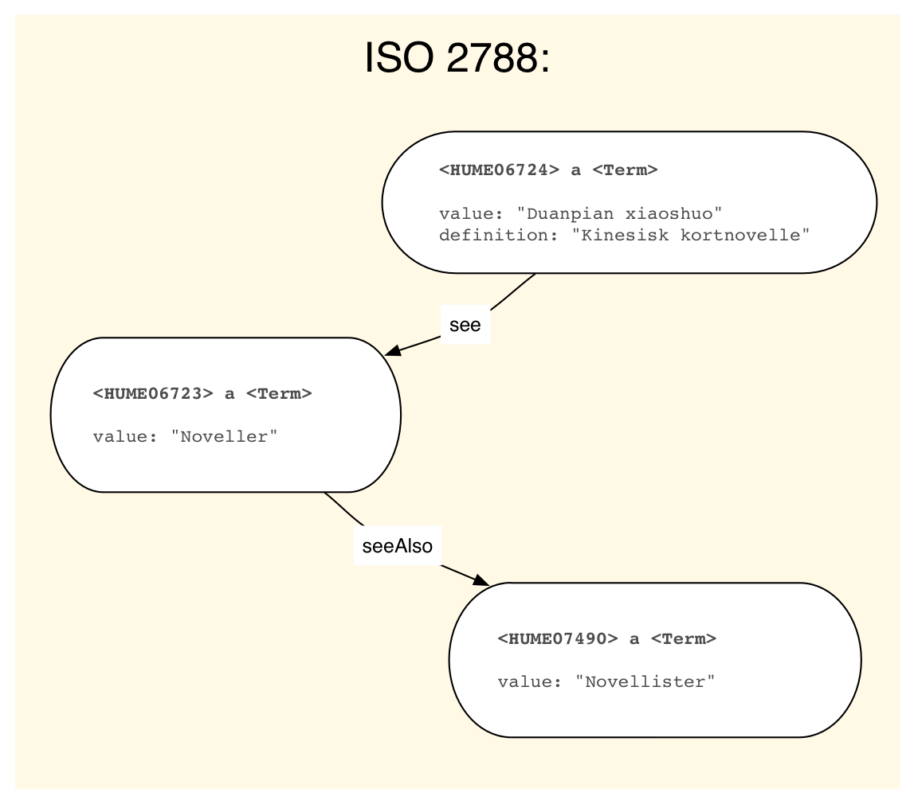
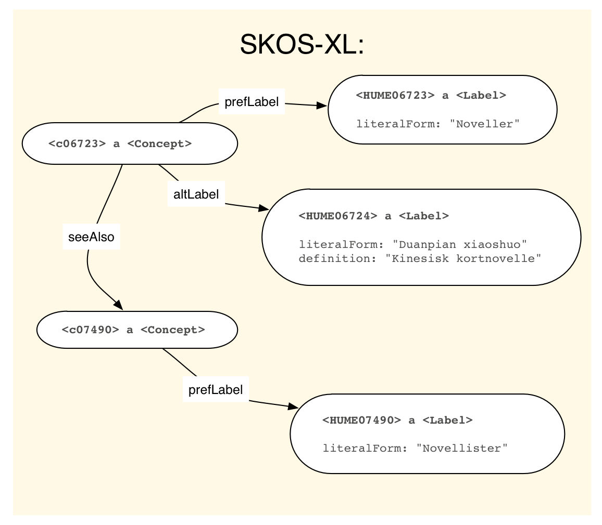

Det som ikke gikk opp for meg da var at det faktisk er et markant skille mellom datamodellen i Realfagstermer og Humord. Mens Realfagstermer er begrepsbasert og ligger nærmere SKOS og ISO 25694, er Humord termbasert og ligger nærmere ISO 2788. Grunnen til at jeg ikke la merke til det er at de to modellene i stor grad er kompatible. Det er lett å forestille seg hvordan to termer relatert gjennom en "SE"-relasjon er uttrykk for det samme underliggende begrepet, selv om begreper ikke er eksplisitt uttrykt i ISO 2788 (OK, jeg må innrømme at jeg ikke har lest ISO 2788).

Men djevelen ligger som vanlig i detaljene. Det gikk et lys opp for meg da Grete skrev om note-felter på se-henvisninger. Disse er så sjeldne i Humord at jeg hadde oversett dem, men de finnes altså;

	HUME06723
	TE Noveller

	HUME06724
	TE Duanpian xiaoshuo
	DE Kinesisk kortnovelle
	SE HUME06723

	HUME07490
	TE Novellister

La oss tegne det slik:

Hvordan ser dette ut som SKOS?

Siden altLabel er literaler, ikke klasser, har vi rett og slett ingen mulighet til å legge på definisjonen "Kinesisk kortnovelle". Bam! Man begynner å forstå hvorfor noen tok seg bryet med å lage SKOS-XL:

som ligger nærmere en viss standard:

Her ser vi godt at ISO 25964 er mye mer komplisert enn ISO 2788.
Selv om ISO 25964, som SKOS, er begrepssentrert, tar den også opp i seg at termer er entiteter som selv kan ha noter og definisjoner.

Spørsmålet er selvfølgelig: trenger vi kompleksisteten i ISO 25964 og SKOS-XL, eller klarer vi oss med SKOS? Er "Duanpian xiaoshuo" egentlig en term, eller et begrep i seg selv? Hvorfor kan vi ikke angi at noe er et begrep, men at det ikke skal brukes i indeksering?

## MADS

Det kan også være interessant å ta en titt på MADS

Merk at MADS er "not intended to be a crosswalk that allows for bi-directional conversions without some loss of data". http://www.loc.gov/standards/mads/mads-mapping.html#mapping

I MARC21 er det ulike måter å uttrykke se-henvisninger. Med *simple cross references* uttrykkes strengene direkte i tracing fields som "unauthorized headings" – uten noen egen MARC-post! Med *complex cross references* har referansene egen MARC-post. En post med 008/09 b [untraced reference record] nærmer seg antakelig det vi har i Humord.

Datamodellen i Realfagstermer ligger svært nær SKOS, og nærmere ISO 25694 enn ISO 2788, mens Humord følger ISO 2788. 
